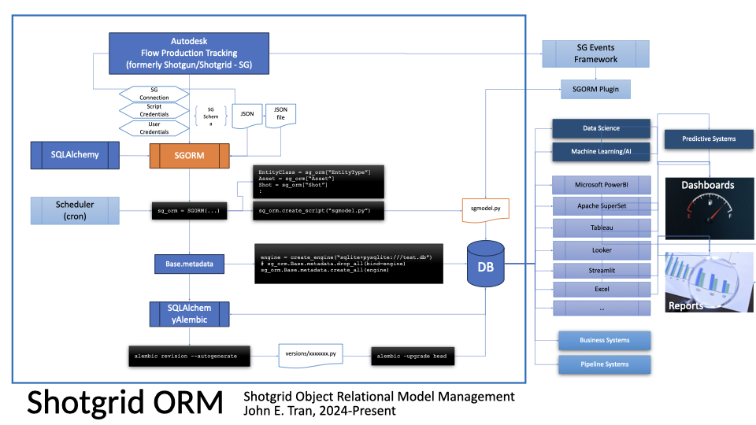

# Shotgrid ORM Generator


[](https://github.com/johnetran/shotgrid_orm/actions/workflows/test.yml)
[](https://codecov.io/gh/johnetran/shotgrid_orm)
[](https://github.com/psf/black)

## For Autodesk Flow Production Tracking system (formerly Shotgun/Shotgrid - SG)

This tool generates a SQLAlchemy ORM for a Shotgrid schema for the purposes of reporting, BI, data warehousing, and analytics. It does not generate foreign key constraints and primary keys are not auto-increment. This allows maximum freedom to transfer data from Shotgrid into a target database, retaining its native primary keys (IDs).

## Overview


## Installation

Install from PyPI:

```bash
pip install shotgrid_orm
```

Or install from source:

```bash
git clone https://github.com/johnetran/shotgrid_orm.git
cd shotgrid_orm
pip install -e .
```

## Requirements

- Python 3.7 or higher
- SQLAlchemy 2.0.22+
- shotgun-api3 3.4.0+
- sqlacodegen-v2 0.1.4+
- alembic 1.12.1+

## Features

- **Multiple Schema Sources**: Load schemas from JSON files, JSON text, or live Shotgrid connections
- **Dynamic ORM Generation**: Creates SQLAlchemy 2.0 declarative models with proper type hints
- **Standalone Script Export**: Generate self-contained Python files with your ORM models
- **Preserve Shotgrid IDs**: Non-auto-increment primary keys maintain original Shotgrid identifiers
- **Polymorphic Relationships**: Handles entity and multi-entity fields with automatic _id and _type columns
- **Alembic Integration**: Built-in support for database migrations
- **Flexible Design**: No forced foreign key constraints for maximum data transfer flexibility

## Usage:

```python
import os
from shotgrid_orm import SGORM, SchemaType

# Create model script

# option 1: create python script from JSON schema file
sg_orm = SGORM(sg_schema_type=SchemaType.JSON_FILE, sg_schema_source="schema.json", echo=ECHO)
print("creating python script")
sg_orm.create_script("sgmodel.py")
Shot = sg_orm.classes.get("Shot")

# option 2: create python script from live connection using SCRIPT KEY
sg_orm = SGORM(sg_schema_type=SchemaType.SG_SCRIPT, sg_schema_source={"url": os.getenv("SG_URL"), "script": os.getenv("SG_SCRIPT"), "api_key": os.getenv("SG_API_KEY")}, echo=ECHO)
print("creating python script")
sg_orm.create_script("sgmodel.py")
Shot = sg_orm.classes.get("Shot")

###

from sqlalchemy import create_engine

# create database from orm
print("creating engine and session to Sqlite db")
engine = create_engine("sqlite+pysqlite:///sgmodel.db", echo=ECHO)

print("dropping all tables")
sg_orm.Base.metadata.drop_all(bind=engine)

print("creating all tables")
sg_orm.Base.metadata.create_all(engine)

###

# manipulating records

from sqlalchemy.orm import Session
from sqlalchemy import select
import sgmodel # created in the create model script step

engine.connect()
session = Session(engine)

asset = sgmodel.Asset()
asset.id = 1

# query an asset
asset = session.execute(select(sgmodel.Asset).where(sgmodel.Asset.id==1)).scalar_one_or_none()
if (asset):
    print(f"deleting asset id: {asset.id}, code: {asset.code}")
    session.delete(asset)
    session.flush()
    session.commit()

# create a new asset
new_asset = sgmodel.Asset()
new_asset.id = 1
new_asset.code = "TestAsset"

session.add(new_asset)
print(f"sesion new asset: {session.new}")
session.flush()

print(f"new asset id: {new_asset.id}, code: {new_asset.code}")
session.commit()

new_asset.code = "UpdatedAssetName"
session.commit()

changed_asset = session.execute(select(sgmodel.Asset).where(sgmodel.Asset.id==new_asset.id)).scalar_one()
print(f"updated asset id: {changed_asset.id}, code: {changed_asset.code}")

shot_class = sgmodel.CLASSES.get("Shot")
print(f"shot_class: {shot_class}")

shot = session.execute(select(shot_class).where(shot_class.id==1)).scalar_one_or_none()
if (shot):
    print(f"deleting shot id: {shot.id}, code: {shot.code}")
    session.delete(shot)
    session.flush()
    session.commit()

# this is important for dynamcially setting SG data
args = {"id": 1, "code": "TestShot"}
new_shot = shot_class(**args)
# other methods:
# new_shot = shot_class(id=1, code="TestShot")
# new_shot.id = 1
# new_shot.code = "TestShot"

session.add(new_shot)
print(f"sesion new shot: {session.new}")
session.flush()

print(f"new shot id: {new_shot.id}, code: {new_shot.code}")
session.commit()

session.close()
```

## Environment Variables

For live Shotgrid connections, set these environment variables:

```bash
export SG_URL="https://your-studio.shotgunstudio.com"
export SG_SCRIPT="your_script_name"
export SG_API_KEY="your_api_key_here"
```

## Known Limitations

- **Foreign Keys**: ForeignKey constraints are intentionally not generated to allow flexibility in data transfer. You can add them manually if needed.
- **Entity Relationships**: Entity and multi-entity types are stored as integer IDs and strings rather than full SQLAlchemy relationship() objects.
- **Complex Types**: Serializable fields (dicts/JSON) and URL fields are stored as strings. Consider JSON serialization for complex use cases.
- **Read-Only Fields**: Some Shotgrid field types (like image) are read-only and stored as strings.

## Use Cases

- **Data Warehousing**: Extract Shotgrid data into analytical databases (PostgreSQL, MySQL, etc.)
- **Reporting & BI**: Build custom reports using standard SQL tools
- **Data Migration**: Transfer Shotgrid data between environments while preserving IDs
- **Backup & Archival**: Create local copies of Shotgrid data with full schema preservation
- **Custom Integrations**: Build applications that work with Shotgrid data offline

## Contributing

Contributions are welcome! Please feel free to submit a Pull Request. For major changes, please open an issue first to discuss what you would like to change.

## License

This project is licensed under the MIT License - see the [LICENSE](LICENSE) file for details.

## Acknowledgments

- Built with [SQLAlchemy](https://www.sqlalchemy.org/)
- Schema code generation powered by [sqlacodegen-v2](https://github.com/ksindi/sqlacodegen)
- Shotgrid API integration via [shotgun-api3](https://github.com/shotgunsoftware/python-api)

## Links

- **PyPI**: https://pypi.org/project/shotgrid_orm/
- **GitHub**: https://github.com/johnetran/shotgrid_orm
- **Issues**: https://github.com/johnetran/shotgrid_orm/issues
- **Autodesk Flow Production Tracking**: https://www.autodesk.com/products/flow-production-tracking/
